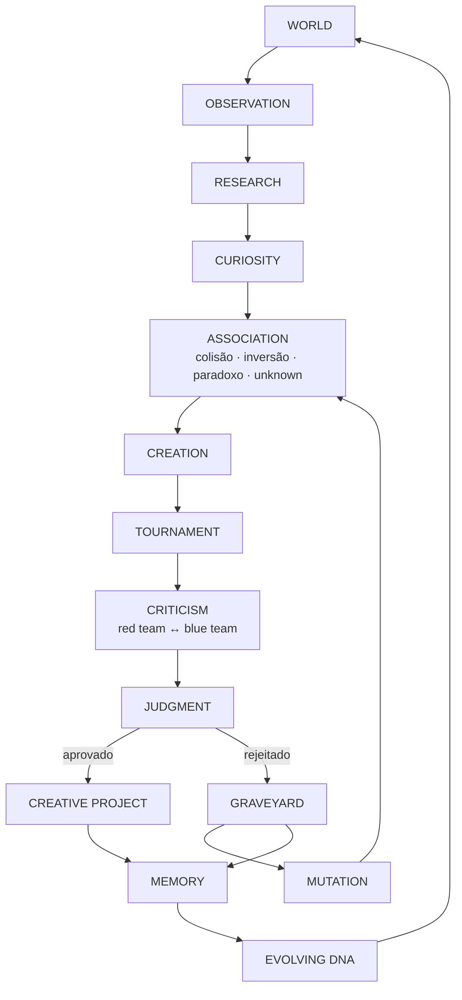
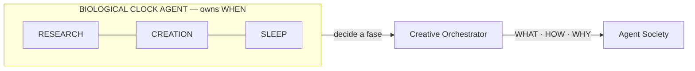
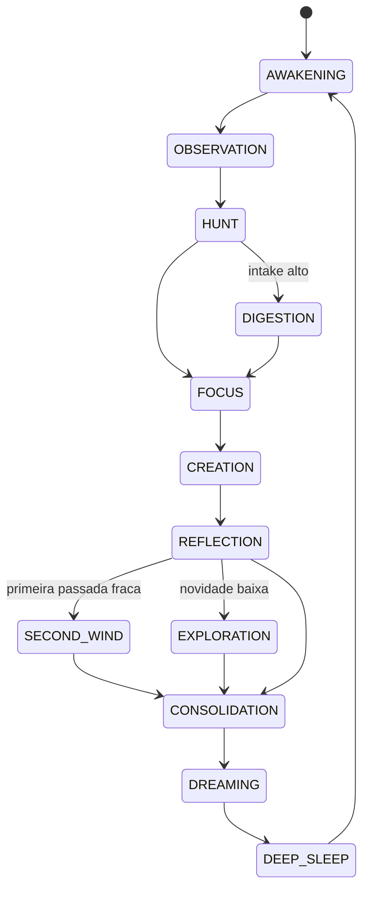
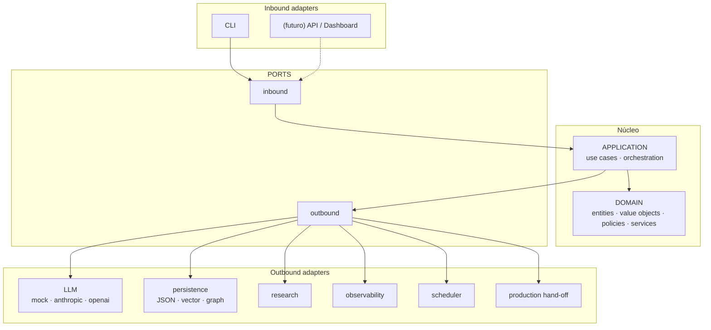
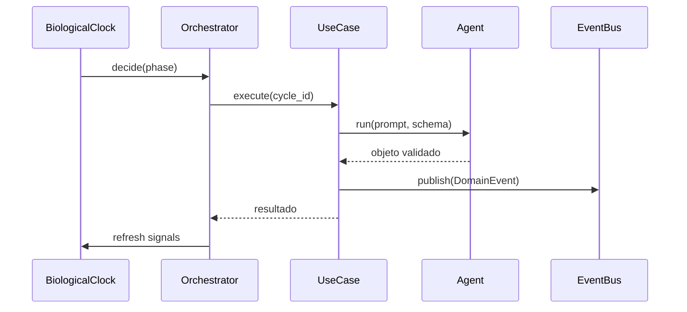
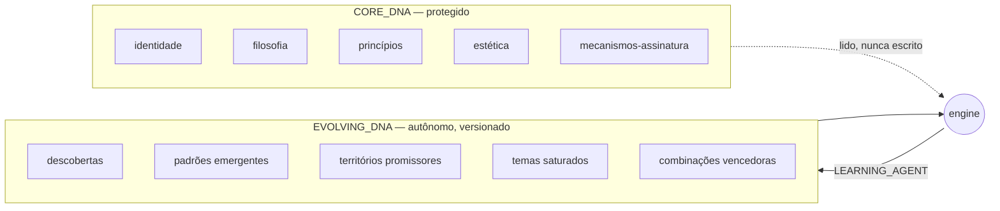

# PEDRO_ARTE_DNA_MY_CREATIVE_BRAIN

**CÉREBRO CRIATIVO MULTIAGENTE PEDRO ARTE**
*PEDRO ARTE CREATIVE MIND ENGINE — PACME*

> ⚠️ **CONFIDENTIAL · PRIVATE · PROPRIETARY · EXPERIMENTAL**
> Este repositório contém propriedade intelectual privada: DNA criativo, prompts,
> memórias, conceitos, mundos e obras em desenvolvimento. Ele **nunca** deve se
> tornar público, ser espelhado, publicado, indexado ou usado como corpus de
> treinamento. Ver [LICENSE](LICENSE) e [SECURITY.md](SECURITY.md).

---

## 1. O que é

Isto **não** é um chatbot. **Não** é uma prompt chain. **Não** é um gerador de ideias.

É um **CREATIVE OPERATING SYSTEM**: um sistema autônomo que simula um processo
criativo completo — observar, pesquisar, questionar, associar, colidir, criar,
criticar, destruir, reconstruir, julgar, aprender, dormir, sonhar e recomeçar —
com uma sociedade de **34 agentes especializados**, um **relógio biológico
artificial** que decide *quando* cada coisa acontece, um **torneio criativo**
que mata a maior parte do que ele mesmo produziu, e uma **memória evolutiva**
que nunca apaga nada.

O objetivo não é produzir mais conteúdo. É produzir:

```
NOVAS PERGUNTAS  →  NOVOS CONCEITOS  →  NOVOS MUNDOS  →  NOVAS OBRAS
```

sem depender continuamente de intervenção humana.

---

## 2. Por que existe

O sistema não aprende **o que Pedro Arte criou**. Aprende **como Pedro Arte cria**:

| O que copiamos ❌ | O que modelamos ✅ |
|---|---|
| temas recorrentes | mecanismos mentais |
| vocabulário | formas de questionar |
| cenários | estratégias de inversão |
| personagens | padrões de colisão conceitual |
| finais | modos de explorar consequências |

O `PEDRO_DNA_AGENT` existe justamente para reprovar candidatos que imitam a
superfície sem reproduzir o mecanismo.

---

## 3. Como funciona — do despertar ao sono



Tudo isso acontece **dentro** do relógio biológico:



---

## 4. O relógio biológico

O coração do sistema. **Não é um cron.** É uma política pura de domínio
(`CircadianPolicy`) que lê o estado da mente e decide a próxima fase.



### O que o relógio lê

| Sinal | Efeito |
|---|---|
| `creative_energy` | abaixo do piso → não cria, consolida ou dorme |
| `research_energy` | abaixo do piso → pula OBSERVATION/HUNT |
| `critical_energy` | abaixo do piso → adia REFLECTION |
| `memory_pressure` | acima do teto → CONSOLIDATION preempta tudo |
| `novelty_pressure` | acima do teto → força EXPLORATION |
| backlogs | intake ≥ 8 → DIGESTION antes de criar |
| `duplicate_rate` | alto → EXPLORATION |
| `recent_quality` | baixa → SECOND_WIND (revisita rejeitados) |
| orçamento (calls/USD) | esgotado → CONSOLIDATION → DEEP_SLEEP |

> **Sobre a metáfora de energia:** são heurísticas de orquestração, não
> simulação de biologia e **não** uma alegação de senciência. Servem para
> alternar entre modos divergentes e convergentes em vez de martelar um único
> modo até a qualidade desabar.

### As 12 fases

| Fase | O que acontece |
|---|---|
| `AWAKENING` | recarrega contexto, ingere corpus, lê DNA e ciclos anteriores |
| `OBSERVATION` | captura fatos, tendências, esquisitices, contradições |
| `HUNT` | pesquisa profunda dos temas mais salientes |
| `FOCUS` | transforma observações em perguntas; define o foco do ciclo |
| `CREATION` | pico generativo: 5 geradores divergentes → sementes → conceitos |
| `DIGESTION` | depois de muita informação: **não criar**; reduzir ruído |
| `REFLECTION` | avalia, compete, julga e desenvolve o vencedor |
| `SECOND_WIND` | muta o que foi rejeitado na primeira passada |
| `EXPLORATION` | afasta-se do DNA quando a novidade cai |
| `CONSOLIDATION` | memória, obsessões, meta-cognição, EVOLVING_DNA |
| `DREAMING` | associação livre, sem plausibilidade; ressuscita mortos |
| `DEEP_SLEEP` | nada é aprovado; compacta, verifica, prepara o despertar |

---

## 5. Arquitetura hexagonal



**A regra:**

```
DEPENDENCIES POINT INWARD
```

O domínio depende **apenas da biblioteca padrão do Python**. Não conhece LLMs,
bancos de dados, frameworks, HTTP, filesystem, Anthropic, OpenAI, Redis ou
vector stores. Isso é verificado automaticamente em `tests/architecture/`.

### Estrutura

```
src/creative_brain/
├── domain/          # regras. zero dependências externas
│   ├── entities/            CreativeConcept, CreativeTournament, CircadianState…
│   ├── value_objects/       CreativeScore, CreativeDistance, CreativeGenome, DNA…
│   ├── policies/            lifecycle, circadian, scoring, mutação, constituição…
│   ├── services/            novidade, distância, diversidade, saturação, torneio
│   ├── specifications/      predicados componíveis
│   └── events/              catálogo de domain events
├── ports/           # contratos
│   ├── inbound/             RuntimeControlPort, InspectionPort
│   └── outbound/            LLMPort, ClockPort, RandomPort, repositories…
├── adapters/        # implementações
│   ├── llm/                 mock (offline) · anthropic · openai · router
│   ├── persistence/         JSON atômico · vector lexical · knowledge graph
│   ├── research/            offline · web
│   ├── prompts/             biblioteca de prompts versionados
│   ├── clock/               SystemClock · FakeClock
│   ├── randomness/          SeededRandom
│   ├── events/              InMemoryEventBus + dead letter
│   ├── scheduler/           InProcessScheduler
│   ├── observability/       logs estruturados · métricas
│   ├── filesystem/          ingestão de corpus · escrita de outputs
│   └── production/          hand-off para motores externos
├── application/     # casos de uso e orquestração
├── agents/          # a sociedade multiagente
├── biological_clock/# BIOLOGICAL_CLOCK_AGENT
├── runtime/         # AutonomousCreativeRuntime
├── composition/     # o único lugar que conhece ports E adapters
└── cli/             # adapter inbound
```

---

## 6. A sociedade multiagente

Cada agente é um participante **real**, com prompt próprio, papel de modelo
próprio, temperatura própria, schema de saída próprio e direitos de decisão
próprios. Não existe um agente fingindo ser vários.

| Agente | Papel | Direitos |
|---|---|---|
| `PEDRO_DNA_AGENT` | guardião do mecanismo criativo | score, **veto** |
| `OBSERVER_AGENT` | sensor do mundo | observe only |
| `RESEARCH_AGENT` | investigação profunda | propose |
| `CURIOSITY_AGENT` | transforma observação em pergunta | propose |
| `WHAT_IF_AGENT` | hipóteses "e se…?" | propose |
| `CONCEPT_COLLIDER_AGENT` | colide conceitos desconexos | propose |
| `INVERSION_AGENT` | inverte eixos conceituais | propose |
| `PARADOX_AGENT` | caça paradoxos vivíveis | propose |
| `THE_UNKNOWN_AGENT` | *o que ainda não foi pensado?* | propose |
| `CONCEPT_BUILDER` | semente → conceito estruturado | propose |
| `EXTREME_CONSEQUENCE_AGENT` | T+1 · T+10 · T+50 · T+100 anos | propose |
| `REALITY_ANCHOR_AGENT` | como isso emergiria da realidade atual? | score |
| `BRAZILIAN_REALITY_AGENT` | evita "história americana traduzida" | score, **veto** |
| `WORLD_ARCHITECT_AGENT` | regras, economia, instituições, classes | propose |
| `CHARACTER_ARCHITECT_AGENT` | posições diante do sistema | propose |
| `HUMAN_DRAMA_AGENT` | *por que um humano se importaria?* | score, **veto** |
| `ELEGANCE_AGENT` | subtexto, atmosfera, recusa do choque gratuito | score |
| `ANTI_CLICHE_AGENT` | tenta provar que a ideia é derivativa | score, **veto** |
| `NOVELTY_AGENT` | novidade contra memória, cânone e cemitério | score |
| `TITLE_AGENT` | títulos curtos com duplo sentido | propose |
| `MARKET_AGENT` | pitch, audiência, potencial audiovisual | score (limitado) |
| `LORE_CONNECTION_AGENT` | conexões opcionais entre obras | propose |
| `RED_TEAM_AGENT` | **destrói** a ideia | score, **veto** |
| `BLUE_TEAM_AGENT` | defende contra o red team | score |
| `CREATIVE_JUDGE_AGENT` | **julga** — não cria, não reescreve | **decide**, veto |
| `OBSESSION_AGENT` | obsessão × repetição disfarçada | propose |
| `MUTATION_AGENT` | segunda vida estrutural para ideias mortas | propose |
| `DREAM_AGENT` | subconsciente, sem filtro de plausibilidade | propose |
| `MEMORY_AGENT` | consolida memória (evento ≠ princípio) | **learn** |
| `LEARNING_AGENT` | analisa o ciclo, atualiza EVOLVING_DNA | **learn** |
| `META_COGNITION_AGENT` | *estamos pensando diferente ou repetindo?* | propose |
| `PITCH_BUILDER` / `SYNOPSIS_BUILDER` | prosa do vencedor | propose |
| `BIOLOGICAL_CLOCK_AGENT` | **owns WHEN** (política pura, sem LLM) | **schedule**, decide |

### Como os agentes conversam

Eles **não** conversam. Agentes nunca chamam agentes. Toda coordenação passa por
**use cases**, **domain events** e o **orchestrator** — é isso que impede a
"agent spaghetti architecture".



---

## 7. DNA criativo — dois níveis



* `memory/core_dna/` — **somente leitura para o motor**. `CoreDna.mutate()`
  levanta `ImmutableCoreDnaViolation` por construção. Não existe
  `save_core()` no repositório.
* `memory/evolving_dna/` — evolui sozinho, com versão incremental, changelog e
  snapshot imutável por versão.

---

## 8. Creative Tournament

```
concepts → 30 → 10 → 5 → 3 → 1 vencedor
```

Números configuráveis em `config/scoring.yaml`. A seleção **não é um ranking
puro**: três pressões operam juntas.

1. **Score ponderado** — pesos externos, nunca escondidos no código.
2. **Diversidade** — dois sobreviventes da mesma rodada não podem ter
   similaridade ≥ 0,60 (artigo 11: repetição conceitual disfarçada).
3. **Constituição** — um candidato que viola um artigo bloqueante **não passa**,
   qualquer que seja a nota.

```yaml
originality: 0.20          # ← nunca escondido no código
narrative_potential: 0.15
depth: 0.15
plausibility: 0.10
emotional_impact: 0.10
commercial_potential: 0.10 # ← teto de 0.25; mercado nunca decide sozinho
authorial_identity: 0.10
expandability: 0.05
audiovisual_potential: 0.05
```

### Creative Distance

```
0 ─────── 25 ─────── 50 ─────── 75 ─────── 100
cópia    variação   familiar   altamente  distante
                    e nova     original   do DNA
└── COMFORT ──┴──── EDGE ─────┴─── UNKNOWN ──────┘
     30%            50%             20%
```

---

## 9. Memória

| Subsistema | Conteúdo | Decai? |
|---|---|---|
| `episodic` | o que aconteceu (eventos brutos) | sim (0,92/ciclo) |
| `semantic` | **princípios aprendidos** | nunca |
| `creative` | conceitos, perguntas, sementes | sim |
| `rejected` | ideias reprovadas + motivos | nunca |
| `successful` | ideias aprovadas | nunca |
| `canon` | obras finalizadas | nunca |
| `experiments` | torneios, sonhos | sim |

**Regra dura:** `RAW EVENT ≠ LEARNED PRINCIPLE`. Um princípio precisa de pelo
menos dois eventos independentes concordando antes de poder mudar o
comportamento do motor.

### Graveyard

`memory/graveyard/` — **nada é apagado, nunca.** Cada ideia enterrada preserva
id, título, conceito, datas, scores, motivos de rejeição, feedback de cada
agente, potencial de mutação e ideias similares.

Ressurreição **copia** a ideia para uma nova linhagem; o túmulo permanece.

### Linhagem

```
Seed A → Concept 17 → (mutação) Concept 17b → (merge) Concept 43 → Winner
```

Toda ideia conhece seus ancestrais (`Lineage`), e o grafo criativo registra as
arestas `derived_from`, `mutated_from`, `resurrected_from`, `shares_theme`.

---

## 10. Dream Mode

Durante `DREAMING` o motor combina conceitos **sem** exigir plausibilidade,
mercado, gênero ou coerência. Depois, na vigília, outros agentes decidem o que
é aproveitável. O Dream Mode também é onde ideias do cemitério podem
ressuscitar (`IdeaResurrected`).

---

## 11. Autonomia

```
AUTONOMOUS CREATIVITY  +  CONTROLLED INFRASTRUCTURE
```

**Não existe** etapa `WAIT_FOR_HUMAN_APPROVAL` no ciclo criativo.

| ✅ O motor decide sozinho | ⛔ Sempre exige um humano |
|---|---|
| observar, pesquisar, perguntar | apagar/publicar o repositório |
| gerar, combinar, inverter | mudar visibilidade do repositório |
| criticar, **rejeitar as próprias ideias** | push para remoto, publicação externa |
| mutar, ressuscitar, sonhar | credenciais e políticas de segurança |
| rodar torneio, julgar, aprovar | modificar código-fonte |
| escrever outputs, consolidar memória | modificar CORE_DNA ou a Constituição |
| atualizar EVOLVING_DNA | gastar dinheiro além do orçamento |
| **decidir seus próprios horários** | apagar memória |

`SELF-EVALUATION ≠ SELF-MODIFYING CODE`. Ver `AutonomyPolicy` e
[`config/autonomy.yaml`](config/autonomy.yaml).

---

## 12. Como executar

```bash
make install
```

Ciclo completo, offline, sem nenhuma API — **este é o caminho recomendado para
ver o sistema funcionando**:

```bash
make demo
```

Equivalente direto:

```bash
creative-brain demo
```

Um único ciclo com logs estruturados:

```bash
creative-brain --mock start --single-cycle
```

Modo autônomo contínuo (Ctrl-C encerra graciosamente, com checkpoint):

```bash
creative-brain --mock start --autonomous
```

Inspeção:

```bash
creative-brain status
creative-brain clock status
creative-brain agents list
creative-brain memory inspect --limit 20
creative-brain graveyard inspect
creative-brain tournament inspect
```

Qualquer comando aceita `--json` para saída legível por máquina.

---

## 13. Como testar

```bash
make test
```

```bash
make architecture-test
```

```bash
make lint
```

```bash
make typecheck
```

```bash
make check
```

Camadas de teste:

| Camada | O que garante |
|---|---|
| `tests/unit` | entidades, VOs, transições, scoring, torneio, relógio, DNA |
| `tests/architecture` | **o domínio não importa infraestrutura** |
| `tests/contract` | adapters cumprem os ports |
| `tests/integration` | repositórios, event bus, scheduler, memória, MockLLM |
| `tests/property` | invariantes (score sempre 0..100, energia sempre 0..100) |
| `tests/regression` | o cemitério nunca perde uma ideia; CORE_DNA nunca muda |
| `tests/e2e` | ciclo completo: wake → … → winner → sleep → resume |

Nenhum teste depende do relógio real: `FakeClock` + `SeededRandom` +
`MockLLMAdapter` tornam cada ciclo reproduzível byte a byte.

---

## 14. Como adicionar um agente

1. **Declare** em `src/creative_brain/agents/definitions.py`:

```python
_d(
    "MY_NEW_AGENT",
    "papel curto",
    "Objetivo em uma frase.",
    "my_new_agent",        # nome do prompt
    "my_new.task",         # task usada pelo router e pelo mock
    model_role=ModelRole.CRITICISM,
    rights=(DecisionRight.SCORE,),
    temperature=0.5,
),
```

2. **Escreva o prompt** em `prompts/agents/my_new_agent.md` com front matter
   (`name`, `version`, `purpose`, `inputs`, `outputs`, `constraints`) e as
   seções `## SYSTEM` e `## USER`.

3. **Mapeie o schema** em `agents/society.py::OUTPUT_MODELS`
   (use `Critique` se for um crítico).

4. **Ligue/desligue** em `config/agents.yaml`.

5. Se for um crítico que pontua candidatos, adicione o id em
   `agents/society.py::CRITIC_AGENTS`.

6. Para rodar offline, registre um handler em
   `adapters/llm/mock_adapter.py` com `@handles("my_new.task")`.

---

## 15. Como configurar um LLM real

```bash
cp .env.example .env
```

```bash
pip install -e ".[anthropic]"
```

No `.env`:

```
CREATIVE_BRAIN_LLM_PROVIDER=anthropic
ANTHROPIC_API_KEY=sk-ant-...
```

Em `config/models.yaml`, copie o bloco `example_anthropic_routing` sobre
`routing` e defina `provider: anthropic`. Mantenha papéis diferentes para
`creative`, `criticism` e `judging` — o motor **não deve** julgar a si mesmo com
o mesmo modelo que criou.

Os orçamentos de `config/biological_clock.yaml` (`max_llm_calls_per_cycle`,
`max_cost_usd_per_cycle`) passam a valer de verdade: ao estourar, o relógio
força `CONSOLIDATION → DEEP_SLEEP`.

---

## 16. Como criar um novo adapter

1. Escolha o port em `src/creative_brain/ports/outbound/`.
2. Implemente a classe em `src/creative_brain/adapters/<área>/`.
   Não herde do `Protocol`; apenas satisfaça a assinatura.
3. Escreva um teste de contrato em `tests/contract/`.
4. Ligue no **único** lugar que conhece adapters:
   `src/creative_brain/composition/container.py`.

Exemplo — trocar a memória vetorial lexical por FAISS: implemente
`VectorMemoryPort`, troque uma linha no container, e mais nada no sistema muda.

---

## 17. Como integrar outro motor de produção

O vencedor de cada ciclo produz um `execution_manifest.json`:

```json
{
  "project_id": "project_a1b2c3d4",
  "title": "...",
  "status": "PRODUCTION_READY",
  "recommended_engines": ["living_book_engine", "youtube_living_book_engine"],
  "creative_scores": { "...": 0 },
  "artifacts": ["characters", "pitch", "premise", "synopsis", "world_bible"]
}
```

Para conectar um motor (Living Book, YouTube Living Book, Living Sound, Game,
Site): implemente `CreativeProductionPort`, registre-o no container e ligue
`production_handoff_enabled: true` em `config/autonomy.yaml`. Os motores
**não** são acoplados a este repositório — só o contrato existe.

---

## 18. Observabilidade

Logs estruturados JSON com `correlation_id`, `cycle_id`, `project_id`,
`agent_id`. Métricas coletadas:

`ideas_generated_total` · `ideas_rejected_total` · `ideas_approved_total` ·
`average_novelty_score` · `average_creative_distance` · `duplicate_rate` ·
`mutation_success_rate` · `agent_disagreement_rate` · `tournament_duration` ·
`llm_calls` · `token_usage` · `estimated_llm_cost_usd` ·
`circadian_phase_duration` · `diversity_score` · `agent_schema_violations`

Cada decisão relevante grava um **decision trace**: WHO · WHAT · WHY · INPUTS ·
SCORES · EVIDENCE · TIMESTAMP. Não registramos raciocínio interno de modelos —
registramos decisões e as evidências estruturadas que as sustentaram.

---

## 19. Outputs

```
outputs/YYYY-MM-DD/cycle_<id>/
├── observations/  questions/  seeds/  concepts/  mutations/
├── tournament/    finalists/  rejected/
├── winner/
│   ├── concept.md  premise.md  pitch.md  synopsis.md
│   ├── world_bible.md  characters.md
│   ├── evaluation.json  execution_manifest.json
├── genome/creative_genome.yaml
├── learning/
└── runtime/
```

---

## 20. A visão maior

```
                      WORLD
                        │
                        ▼
                OBSERVATION LAYER
                        │
                        ▼
                  CREATIVE MIND
                        │
           ┌────────────┼────────────┐
           ▼            ▼            ▼
       MEMORY      SUBCONSCIOUS   REASONING
           │            │            │
           └────────────┼────────────┘
                        ▼
                   TOURNAMENT
                        │
                        ▼
                     JUDGE
                        │
                        ▼
                 CREATIVE PROJECT
                        │
                        ▼
              PRODUCTION MANIFEST
```

O sistema tem memória, consciência operacional, subconsciente criativo,
curiosidade, crítica, sonhos, obsessões, ritmo e aprendizado.

> **Isso são abstrações arquiteturais inspiradas em processos cognitivos.**
> Não há alegação de consciência real ou senciência, e o sistema é instruído a
> nunca se apresentar dessa forma.

---

## 21. A pergunta central

```
O QUE AINDA NÃO FOI PENSADO?
```

É a pergunta do `THE_UNKNOWN_AGENT` e a razão de existir da `UNKNOWN_ZONE`.

---

## Documentação

| Documento | Conteúdo |
|---|---|
| [ARCHITECTURE.md](ARCHITECTURE.md) | arquitetura detalhada, camadas, fluxos |
| [CREATIVE_CONSTITUTION.md](CREATIVE_CONSTITUTION.md) | os 14 artigos |
| [SECURITY.md](SECURITY.md) | classificação de dados, segredos, privacidade |
| [CONTRIBUTING.md](CONTRIBUTING.md) | padrões de código e commits |
| [CHANGELOG.md](CHANGELOG.md) | histórico |
| [docs/adr/](docs/adr/) | Architecture Decision Records |
| [docs/agents/](docs/agents/) | catálogo dos agentes |
| [docs/biological_clock/](docs/biological_clock/) | o relógio em profundidade |
| [docs/memory/](docs/memory/) | memória, cemitério, linhagem |
| [docs/autonomy/](docs/autonomy/) | envelope de autonomia |
